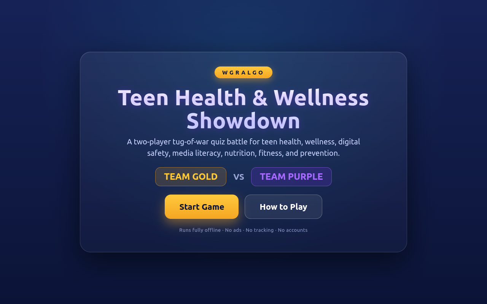
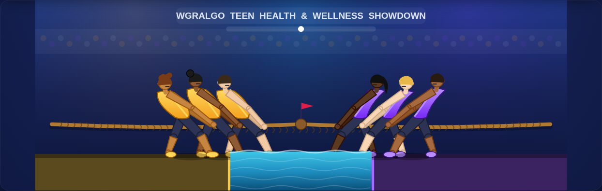
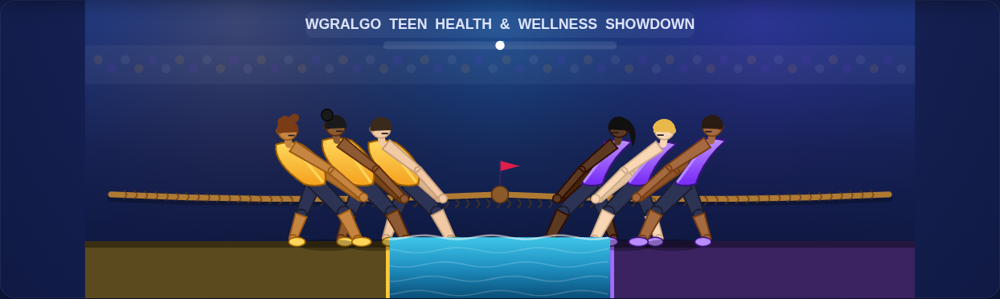
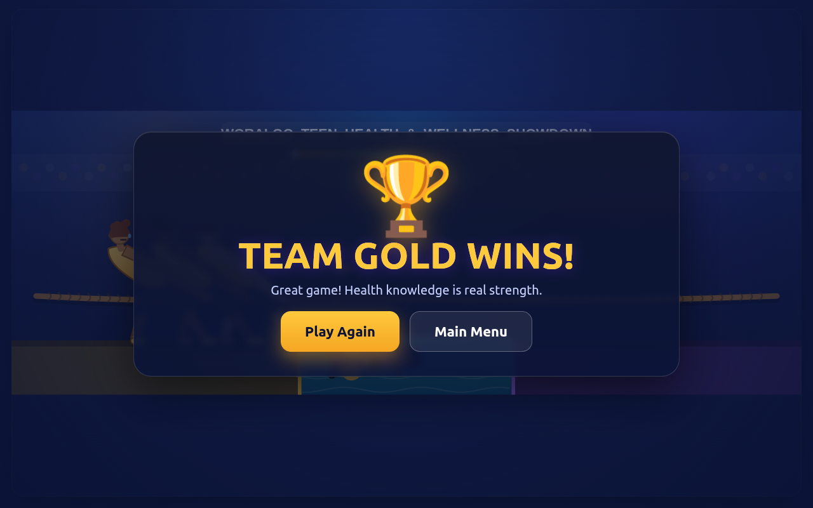

# WGRALGO Teen Health & Wellness Showdown

A free, fully-offline two-player tug-of-war quiz game for Android tablets and
large touchscreens.

**Latest release: [v1.0.4](https://github.com/WGRALGO/WGRALGO-Teen-Health-Wellness-Showdown/releases/tag/v1.0.4)**
— larger 28px question + 18px answer fonts (restored from v1.0.2), boxes
grown to fit the longest entry in the bank without clipping, teens shrunk
and raised on screen, polka-dot crowd band removed; the side-winning
status bar kept. Download the signed APK from the
[Releases page](https://github.com/WGRALGO/WGRALGO-Teen-Health-Wellness-Showdown/releases).

## Description

WGRALGO Teen Health & Wellness Showdown turns health education into a
head-to-head arcade battle. **Team Gold** and **Team Purple** face the same
questions on opposite sides of the screen. Every correct answer hauls the rope
toward your side; every wrong answer hands the other team an advantage. Pull the
opposing team into the water pit to win.

## Purpose

WGRALGO Teen Health & Wellness Showdown is a free educational quiz game designed
to make health, wellness, digital safety, media literacy, nutrition, fitness,
and prevention topics more engaging for teens through a competitive two-player
tug-of-war format.

## Features

- Offline teen health and wellness quiz game (300-question bank)
- Two-player / two-team touchscreen competition
- Tug-of-war battle mechanic with an animated, textured rope
- Professional tablet-first game interface
- Universal tablet fit (since v1.0.4): a fixed 1280×900 design surface scales
  uniformly to any tablet via CSS transform, so character size, question card
  and answer boxes stay pixel-identical from 7" tablets up
- Large, touch-friendly answer buttons sized to fit the longest entry in the
  bank — text never clips; auto-shrink keeps edge cases legible
- Single-tap response: each answer box is a single `pointerup` target with
  debounce + `touch-action: manipulation`, so taps register on the first touch
- Fully illustrated teen characters with braced pulling posture and shadows
- Improved water-fall losing animation with splash particles and ripples
- Polished start screen, How to Play panel, and winner screen with confetti
- Full-reset **Play Again** button
- No ads, no tracking, no accounts, no internet

## Screenshots

| Start | Gameplay |
|-------|----------|
|  |  |

| Question + Teams | Winner |
|------------------|--------|
|  |  |

> Replace with on-device captures any time: **Power + Volume Down**, or
> `adb exec-out screencap -p > screenshots/start.png`.

## Offline & Privacy

WGRALGO Teen Health & Wellness Showdown runs fully offline. It does not upload
data, does not require an account, does not include ads, does not use analytics,
and does not track users.

The app requests **no Android permissions** — including no `INTERNET`
permission. All assets are bundled and loaded locally inside the WebView.

## Medical / Education Note

This app is for general education only and is not medical advice. For personal
health concerns, users should speak with a qualified health professional or
trusted adult.

## How to Play

- Two players or two teams compete — Gold on the left, Purple on the right.
- Read the question shown at the top.
- Tap the answer on your side of the screen.
- Correct answers pull the rope toward your team.
- Wrong answers give the other team an advantage.
- Pull the other team into the water to win.

## Project Structure

```
settings.gradle
build.gradle
app/build.gradle
app/src/main/AndroidManifest.xml
app/src/main/java/com/wgra/teenhealthshowdown/MainActivity.java
app/src/main/assets/www/index.html
app/src/main/assets/www/styles.css
app/src/main/assets/www/game.js
app/src/main/assets/www/questions.js
app/src/main/res/...   (icons, theme, colors)
```

## How to Build

Requirements: JDK 17, Android SDK (platform 34, build-tools 34).

```bash
# Debug APK (no signing required)
./gradlew assembleDebug
# Output: app/build/outputs/apk/debug/app-debug.apk

# Release APK (optional signing)
./gradlew assembleRelease
```

For a signed release, create `keystore.properties` at the project root:

```
storeFile=/absolute/path/to/release.keystore
storePassword=********
keyAlias=********
keyPassword=********
```

(Or set the `THWS_KEYSTORE_FILE`, `THWS_KEYSTORE_PASSWORD`, `THWS_KEY_ALIAS`,
`THWS_KEY_PASSWORD` environment variables.) Keystores are git-ignored and must
never be committed.

The project also opens directly in Android Studio (File → Open → this folder).

## How to Install / Sideload the APK

Easiest path: grab the prebuilt signed APK from the
[latest release](https://github.com/WGRALGO/WGRALGO-Teen-Health-Wellness-Showdown/releases/latest)
(`WGRALGO-TeenHealth-v1.0.4.apk`, 178 KB).

1. Copy the APK to the device, or run `adb install -r WGRALGO-TeenHealth-v1.0.4.apk`.
2. On the device, enable **Install unknown apps** for your file manager.
3. Tap the APK to install.
4. Launch **WGRALGO Teen Health & Wellness Showdown**.

Upgrading from v1.0.0 / v1.0.1 / v1.0.2 installs in place — same signing key,
no uninstall needed.

The app runs entirely offline; airplane mode is fine.

## Controls

Touch only. Each side has four large answer buttons — tap the answer for your
team. A hidden keyboard fallback (1–4 = Gold, 7/8/9/0 = Purple) exists for
desktop testing but is intentionally absent from the on-screen UI.

## Known Limitations

- Designed for landscape tablets / large screens; phones work but are tighter.
- Single device, hot-seat multiplayer only (no online play — by design).
- Question order is randomized each game; there is no score history.

## Version History

See [CHANGELOG.md](CHANGELOG.md) for the full history. Current: **v1.0.4**
(`versionCode 5`).

## Roadmap

- Optional round timer and best-of-N match mode
- Selectable topic categories
- Sound effects and haptic feedback
- Accessibility pass (larger-text and high-contrast modes)

## License

GPLv3 — see [LICENSE](LICENSE).

## Contributors

See [CONTRIBUTORS.md](CONTRIBUTORS.md).
