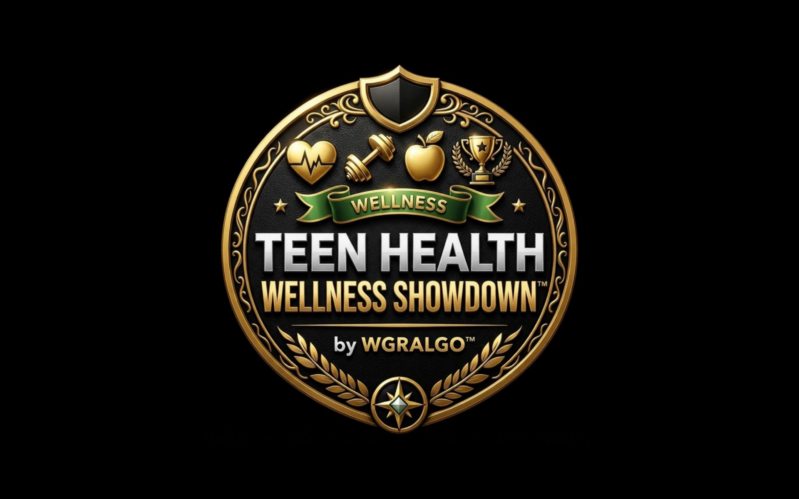
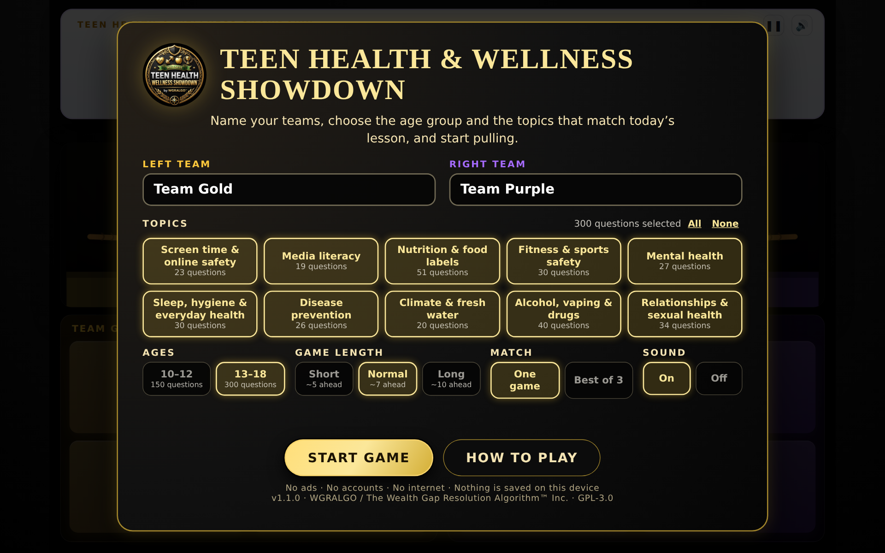
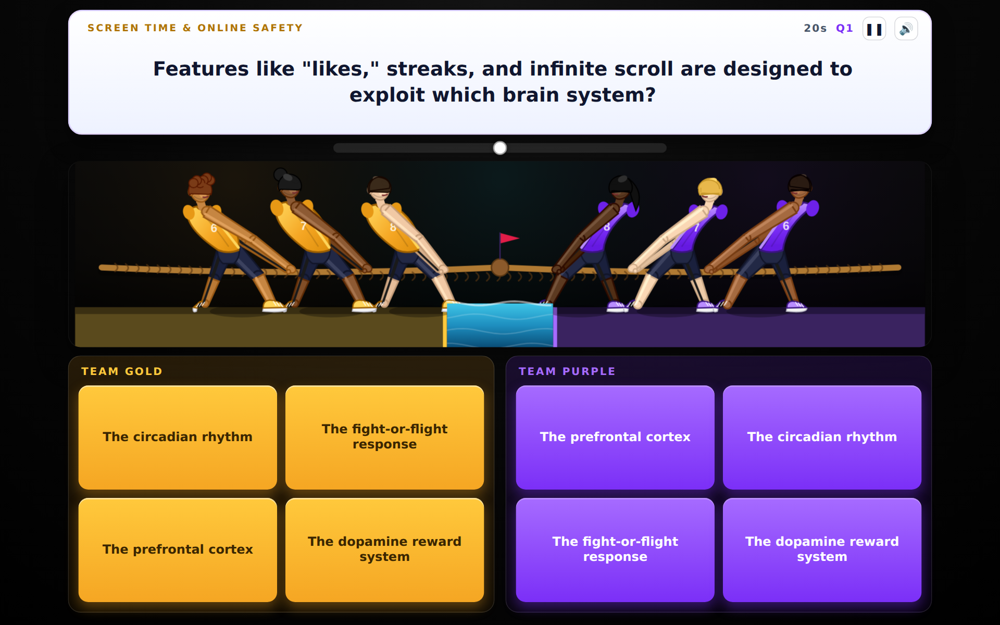
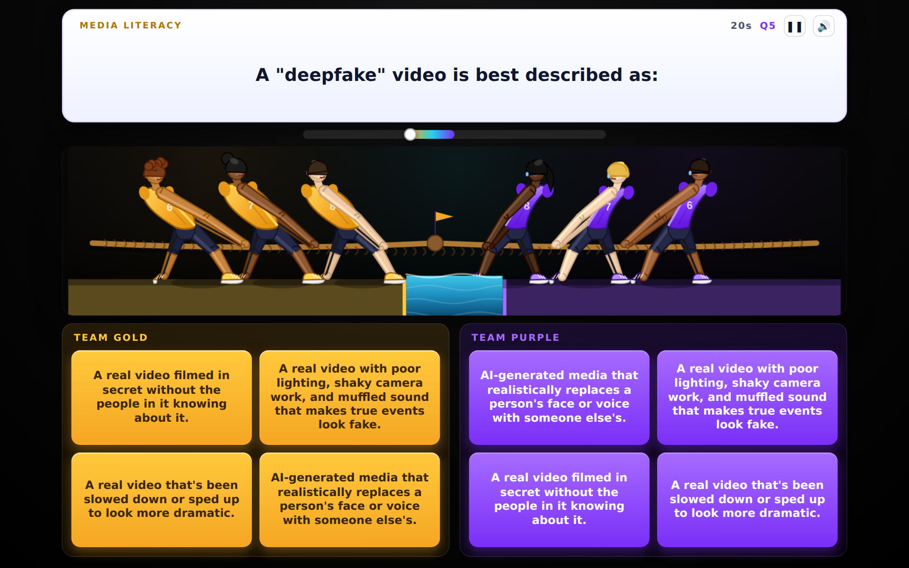
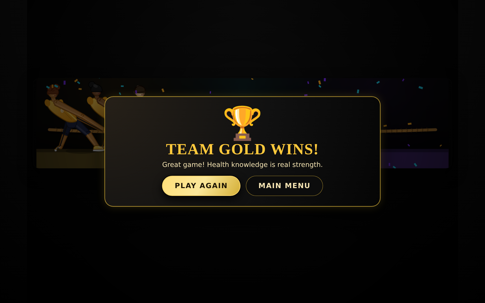

# WGRALGO Teen Health & Wellness Showdown

A free, fully-offline two-player tug-of-war quiz game for Android tablets and
large touchscreens.

**Latest release: [v2.0.0](https://github.com/WGRALGO/WGRALGO-Teen-Health-Wellness-Showdown/releases/tag/v2.0.0)**
— **optimized for tablets in landscape.** The name under the app icon is now
"Teen Health & Wellness Showdown", and the APK is now named `WGRALGO-TeenHealthWellnessShowdown-v2.0.0.apk`.
It installs straight over v1.1.0. Versions 1.0.5 and older used a different
signing key, so uninstall those first (see below). Download the signed APK from the
[Releases page](https://github.com/WGRALGO/WGRALGO-Teen-Health-Wellness-Showdown/releases).

## Description

WGRALGO Teen Health & Wellness Showdown turns health education into a
head-to-head arcade battle. **Team Gold** and **Team Purple** face the same
questions on opposite sides of the screen. Every correct answer hauls the rope
toward your side; every wrong answer hands the other team an advantage. Pull the
opposing team into the water pit to win.

## Purpose

WGRALGO Teen Health & Wellness Showdown is a free educational quiz game designed
to make health, wellness, digital safety, media literacy, nutrition, fitness,
and prevention topics more engaging for teens through a competitive two-player
tug-of-war format.

## Features

- Offline health and wellness quiz game with two question banks:
  **300 questions for ages 13–18** and **150 simpler questions for ages 10–12**
  (with *Growing up & puberty* instead of sexual health)
- Two-player / two-team touchscreen competition on one tablet
- Setup screen: name both teams, pick topics to match the lesson, age group,
  game length (short / normal / long), one game or best of 3, sound on/off
- Each side sees the answers in a different order, so copying won't help
- 20-second question timer (25 for ages 10–12); a wrong answer gives the other
  side a 5-second **steal**; unanswered questions come back later
- Questions don't repeat until every question in the chosen topics has been used
- Tug-of-war battle with illustrated teen characters, a textured rope, a live
  "who's winning" bar, a water-pit fall with splashes, and confetti for the winner
- Sound effects generated in the app (no audio files), pause / resume / restart
- Answers count on first touch, like a buzzer
- Big logo on the launcher icon, the Android splash screen, and the setup screen
- Tips for teachers and crisis lines (988, The Trevor Project) in How to Play
- No ads, no tracking, no accounts, no internet

## Screenshots

Captured from v1.1.0 at tablet size (1280×800 @1.5×).

| Splash | Setup |
|--------|-------|
|  |  |

| Question | Tug-of-war | Winner |
|----------|------------|--------|
|  |  |  |

## Offline & Privacy

WGRALGO Teen Health & Wellness Showdown runs fully offline. It does not upload
data, does not require an account, does not include ads, does not use analytics,
and does not track users.

The app requests **no Android permissions** — including no `INTERNET`
permission. All assets are bundled and loaded locally inside the WebView.
Team names, settings, and scores are not saved; they reset when the app closes.

## Medical / Education Note

This app is for general education only and is not medical advice. For personal
health concerns, users should speak with a qualified health professional or
trusted adult.

## How to Play

- Two players or two teams compete — left side vs right side.
- Read the question at the top, then tap the answer on your side. First touch counts.
- Correct answers pull the rope toward your team.
- A wrong answer gives the other side 5 seconds to **steal**.
- Each question has a 20-second timer (25 seconds for ages 10–12).
- Pull the other team into the water to win.
- Android back button: pauses the game (again to resume); from the setup
  screen it asks before closing the app.

## Project Structure

```
settings.gradle
build.gradle
app/build.gradle
app/src/main/AndroidManifest.xml
app/src/main/java/com/wgra/teenhealthshowdown/MainActivity.java
app/src/main/assets/www/index.html   (the whole game: HTML, CSS, JS, question banks)
app/src/main/assets/www/logo.jpg
app/src/main/res/...                 (launcher icon, splash screen, theme, colors)
tools/validate-release.sh            (release checks)
.github/workflows/                   (debug build on every push, signed release)
release-notes/
```

## How to Build

Requirements: JDK 17, Android SDK (platform 34, build-tools 34).

Run `bash tools/validate-release.sh` (optionally with an APK path) to check a release.

```bash
# Debug APK (no signing required)
./gradlew assembleDebug
# Output: app/build/outputs/apk/debug/app-debug.apk

# Release APK (optional signing)
./gradlew assembleRelease
```

For a signed release, create `keystore.properties` at the project root:

```
storeFile=/absolute/path/to/release.keystore
storePassword=********
keyAlias=********
keyPassword=********
```

(Or set the `THWS_KEYSTORE_FILE`, `THWS_KEYSTORE_PASSWORD`, `THWS_KEY_ALIAS`,
`THWS_KEY_PASSWORD` environment variables.) Keystores are git-ignored and must
never be committed.

The project also opens directly in Android Studio (File → Open → this folder).

### Publishing a release from GitHub

The **Android Signed Release** workflow (`.github/workflows/release.yml`)
builds, signs, validates, and publishes the APK to GitHub Releases. It reads
the keystore from repository secrets (Settings → Secrets and variables →
Actions): `THWS_KEYSTORE_BASE64` (the keystore, base64-encoded),
`THWS_KEYSTORE_PASSWORD`, `THWS_KEY_ALIAS`, and `THWS_KEY_PASSWORD`. Bump
`versionCode` / `versionName` in `app/build.gradle` and the version in the app's
setup screen, add a CHANGELOG entry and `release-notes/v<version>.md`, then run
the workflow from the Actions tab on `main`.

## How to Install / Sideload the APK

Easiest path: grab the prebuilt signed APK from the
[latest release](https://github.com/WGRALGO/WGRALGO-Teen-Health-Wellness-Showdown/releases/latest)
(`WGRALGO-TeenHealthWellnessShowdown-v2.0.0.apk`).

1. Copy the APK to the device, or run `adb install -r WGRALGO-TeenHealthWellnessShowdown-v2.0.0.apk`.
2. On the device, enable **Install unknown apps** for your file manager.
3. Tap the APK to install.
4. Launch **Teen Health & Wellness Showdown**.

> **Have v1.0.5 or older installed? Uninstall it first.** v1.1.0 is signed
> with a new release key, so Android won't install it over older versions. The
> app saves no data, so uninstalling loses nothing. Later updates will install
> over v1.1.0 normally.

Release signing certificate from v1.1.0 onward
(`CN=WGRALGO, OU=Teen Health and Wellness Showdown`), SHA-256 fingerprint:

`2E:6D:7B:93:E0:C1:9D:2D:0A:B4:74:CB:4B:FD:47:E0:5F:43:6A:7E:A1:3D:50:C7:FE:0B:17:60:B9:8C:2D:67`

Verify the download with the `.sha256` file attached to the release:
`sha256sum -c WGRALGO-TeenHealthWellnessShowdown-v2.0.0.apk.sha256`

The app runs entirely offline; airplane mode is fine.

## Controls

Touch only. Each side has four large answer buttons — tap the answer for your
team; it counts on first touch. On-screen pause and sound buttons sit in the
question card. A hidden keyboard fallback (1–4 = left team, 7/8/9/0 = right
team, Esc or P = pause) exists for testing with a keyboard.

## Known Limitations

- Designed for landscape tablets / large screens; phones work but are tighter.
- Single device, hot-seat multiplayer only (no online play — by design).
- Question order is randomized each game; there is no score history (nothing is saved).

## Version History

See [CHANGELOG.md](CHANGELOG.md) for the full history. Current: **v2.0.0**
(`versionCode 7`).

## Roadmap

- Haptic feedback
- Accessibility pass (larger-text and high-contrast modes)

## License

GPLv3 — see [LICENSE](LICENSE).

## Contributors

See [CONTRIBUTORS.md](CONTRIBUTORS.md).
